# System Architecture

## High-Level Architecture Diagram

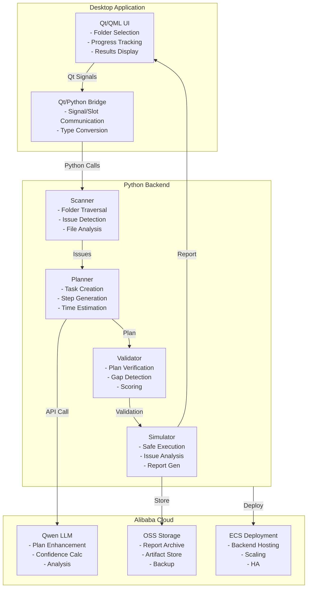

## Component Interaction Flow

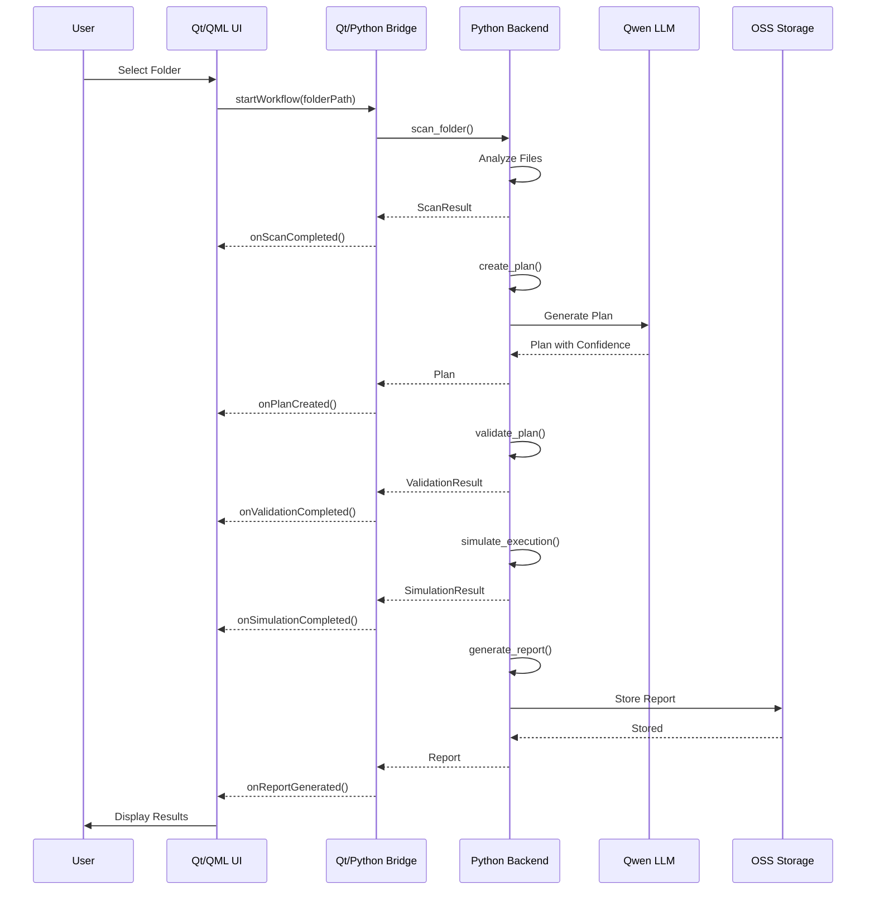

## Data Flow Architecture

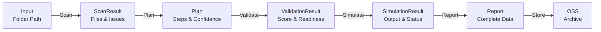

## Deployment Architecture

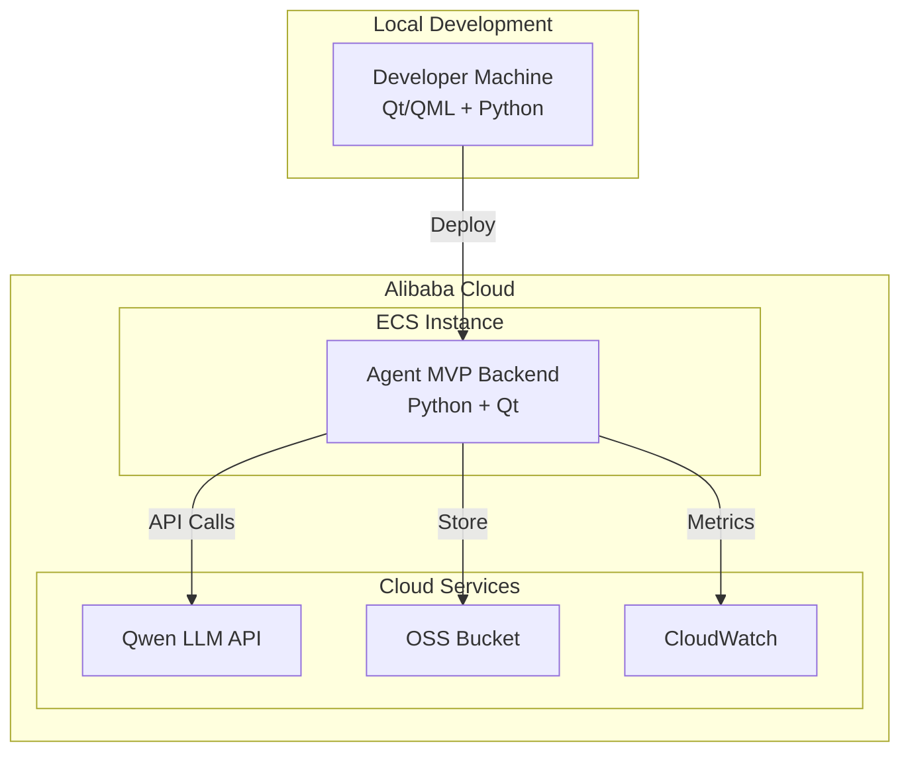

## Technology Stack

### Frontend
- **Qt 6.4.2** — Desktop UI framework
- **QML** — UI markup language
- **C++17** — Native performance

### Backend
- **Python 3.8+** — Core logic
- **JSON** — Data serialization
- **Subprocess** — Command execution

### Cloud Integration
- **Alibaba Cloud Qwen** — LLM services
- **Alibaba Cloud OSS** — Object storage
- **Alibaba Cloud ECS** — Compute resources

### Build & Deployment
- **CMake 3.20+** — Build system
- **Git** — Version control
- **Docker** — Containerization (optional)

## Security Architecture

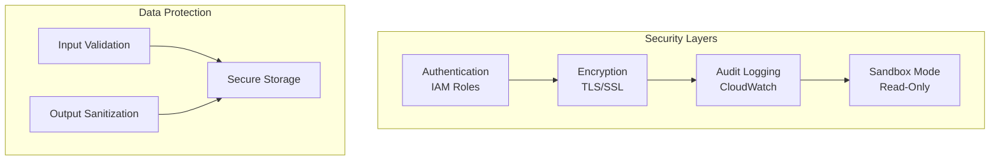

## Performance Architecture

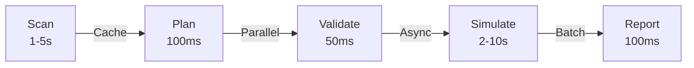

## Scaling Architecture

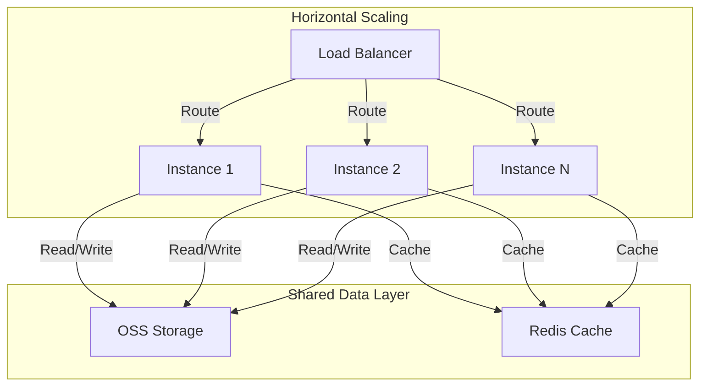

## API Architecture

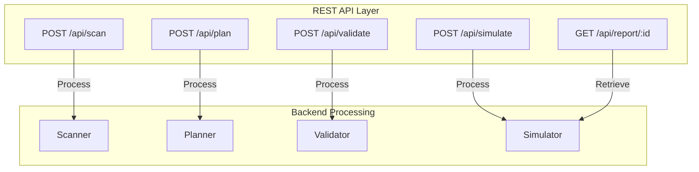

## Database Schema

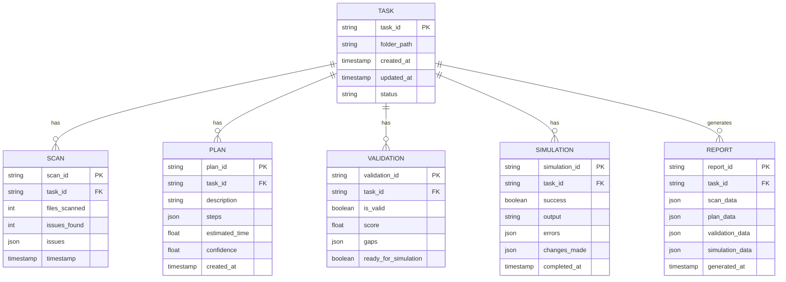

## Error Handling Flow

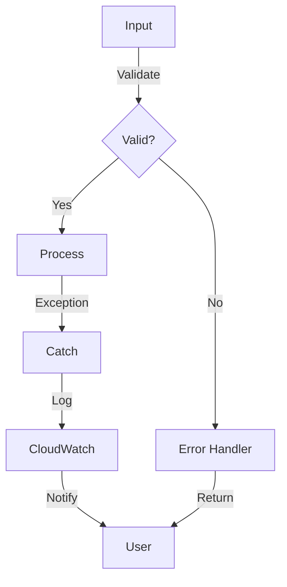

## Monitoring Architecture

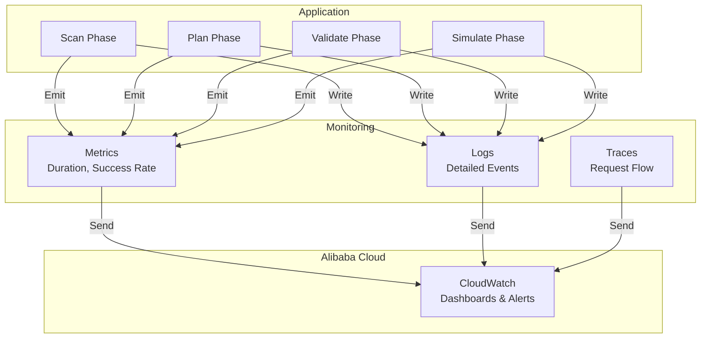

## Deployment Checklist

- [ ] Qt 6.0+ installed
- [ ] Python 3.8+ installed
- [ ] CMake 3.20+ installed
- [ ] Alibaba Cloud credentials configured
- [ ] OSS bucket created
- [ ] Qwen API key obtained
- [ ] ECS instance launched
- [ ] Security groups configured
- [ ] Application built
- [ ] Tests passed
- [ ] Documentation complete

---

**Architecture Version**: 1.0.0 | **Last Updated**: 2026-06-17
